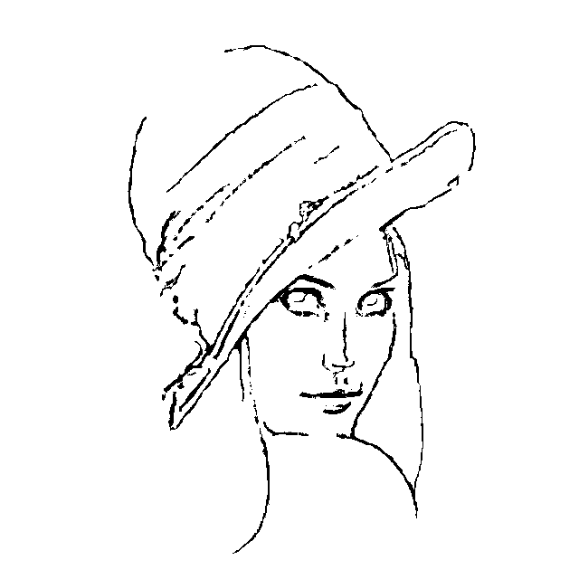

# stringArt-cpp
A personal artistic project for experimenting in multi-threaded programming and SIMD optimizations This is the final version of the prototype I made in Python https://github.com/Stagakis/stringArt

As an example, for a target Image:

The process of the algorithm is the following:

